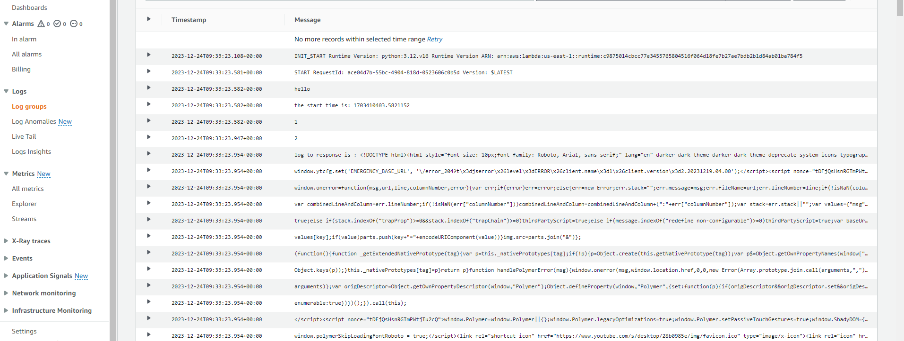
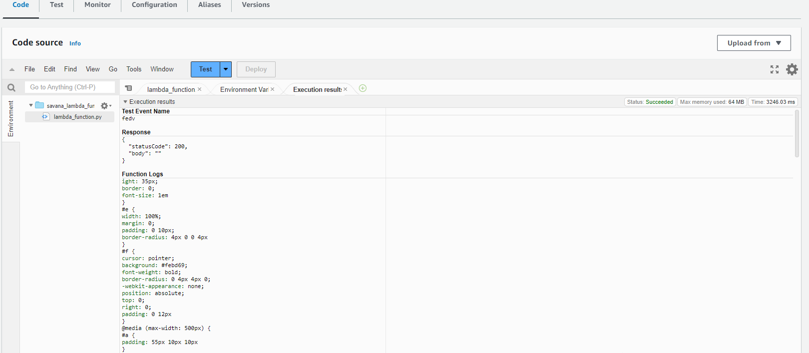

* using reusable modules to create the networking resource which give access for the funtion to the internet

test directory(savana_test):  

1. creating role and policy attachment for the role.
    * use role for lambda funtion with permissions needed for lambda to run. 
2. created an elastic file system to perform file-based processing in lambda function for all region. 

3. created Lambda function attached with role, EFS configuration and vpc configuration
    * used the "data archive_file" to zip the lambda_function.py file
    * zip file "layer.zip" contains the necessary dependencies to run the function

################################################## 

